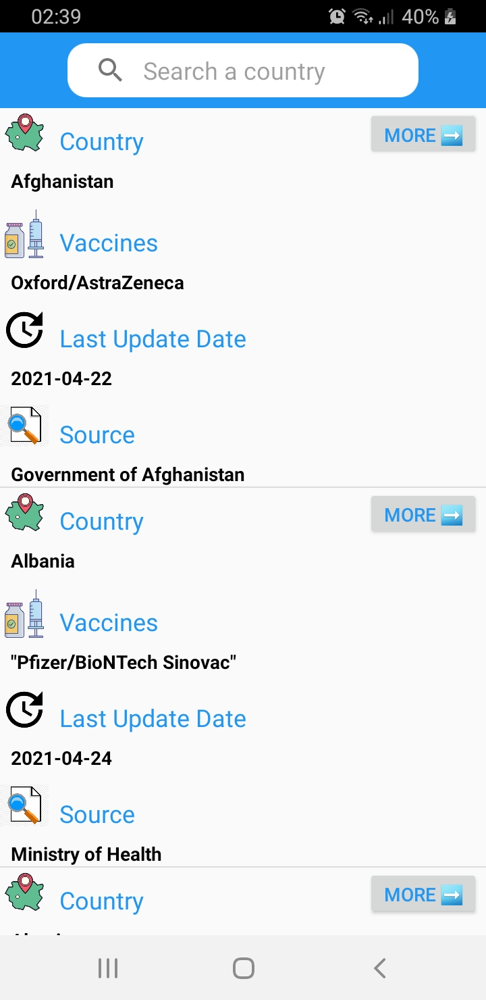
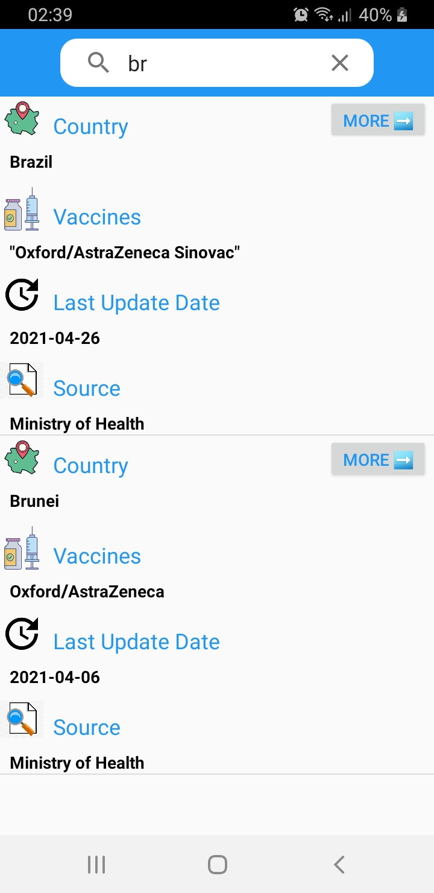
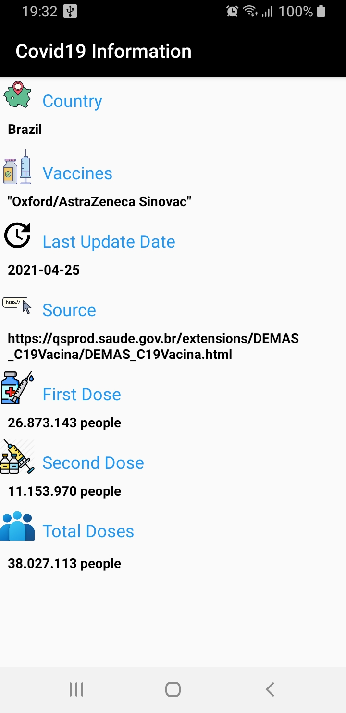

# covid19-information
Android app to fetch COVID19 vaccination information from OWID for many countries to share
with user the current status of first doses, second doses and total doses applied

## This application uses
RecyclerView, SwipeRefreshLayout, ConstraintLayout, LiveData, ViewModel, SeachView

## Covid19 data
github: https://github.com/owid/covid-19-data
Data on COVID-19 (coronavirus) cases, deaths, hospitalizations, tests • All countries • Updated daily by Our World in Data

!
